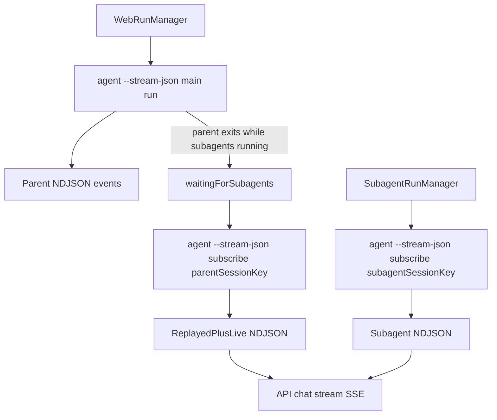

# CLI-Only Streaming Plan (Flaw-Hardened)

## Critical flaws to fix before WS removal

- The current subscribe CLI path in [src/commands/agent-via-gateway.ts](/Users/kumareth/Documents/projects/openclaw/src/commands/agent-via-gateway.ts) calls `callGateway(... expectFinal: false)` and exits after `agent.subscribe` response; it does not remain attached for live events.
- `agent.subscribe` clients still receive global `agent` broadcasts unless filtered client-side; without filtering, per-session subscribe children can ingest unrelated events and cause cross-session noise/duplication.
- Handoff/replay can duplicate already-buffered events unless consumers gate by `globalSeq` (`<= lastSeen` ignore).
- Long “waiting for subagents” SSE windows in [apps/web/app/api/chat/stream/route.ts](/Users/kumareth/Documents/projects/openclaw/apps/web/app/api/chat/stream/route.ts) have no keepalive signal, increasing disconnect risk during quiet periods.

## Revised implementation sequence

1. **Stabilize subscribe transport semantics first**

- Rework subscribe mode in [src/commands/agent-via-gateway.ts](/Users/kumareth/Documents/projects/openclaw/src/commands/agent-via-gateway.ts) to use a long-lived gateway client session (not one-shot `callGateway`) that:
  - connects,
  - sends `agent.subscribe { sessionKey, afterSeq }`,
  - streams events until SIGTERM/SIGINT,
  - emits only matching `sessionKey` events,
  - exits cleanly with `aborted` on signal.
- Add targeted tests for subscribe staying alive and session-key filtering.

2. **Add reusable CLI subscribe spawner**

- In [apps/web/lib/agent-runner.ts](/Users/kumareth/Documents/projects/openclaw/apps/web/lib/agent-runner.ts), add `spawnAgentSubscribeProcess(sessionKey, afterSeq)` using:
  - `node <scriptPath> agent --stream-json --subscribe-session-key <key> --after-seq <n>`
  - same profile/workspace env wiring as `spawnAgentProcess`.

3. **Replace parent waiting flow with subscribe child process**

- In [apps/web/lib/active-runs.ts](/Users/kumareth/Documents/projects/openclaw/apps/web/lib/active-runs.ts):
  - replace `subscribeToSessionKey(...)` usage with a managed subscribe child,
  - parse NDJSON from subscribe child and route through existing parent event processor,
  - dedupe using `globalSeq` (drop stale/replayed duplicates),
  - store/cleanup process handle across finalize/abort/cleanup.

4. **Replace subagent fallback/rehydration with subscribe child process**

- In [apps/web/lib/subagent-runs.ts](/Users/kumareth/Documents/projects/openclaw/apps/web/lib/subagent-runs.ts):
  - swap `subscribeToSessionKey(...)` for one managed subscribe child per running subagent session,
  - feed NDJSON into existing `routeRawEvent`/transform path,
  - use `lastGlobalSeq` dedupe and robust teardown on completion/error/cleanup.

5. **Retire direct web WS client**

- Remove [apps/web/lib/gateway-events.ts](/Users/kumareth/Documents/projects/openclaw/apps/web/lib/gateway-events.ts) imports/usages from web runtime.
- Delete file only after all references are gone and typecheck passes.

6. **Long-wait stream resilience**

- Add lightweight SSE keepalive comments/events while run status is `waiting-for-subagents` in [apps/web/app/api/chat/stream/route.ts](/Users/kumareth/Documents/projects/openclaw/apps/web/app/api/chat/stream/route.ts) or run subscription layer, so idle waits don’t silently time out.

7. **Verification gates**

- Run targeted checks for:
  - parent run -> subagent spawn -> parent wait -> announcement turn -> finalize,
  - page refresh during parent wait,
  - page refresh during subagent live stream,
  - no cross-session event bleed,
  - no duplicate tool/lifecycle events after replay handoff.

## Flow target

