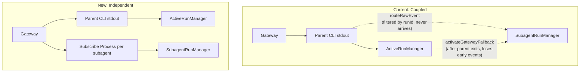

# Interactive Subagent Panel

## Core Problem

Subagent events piggyback on the parent agent's CLI NDJSON stream. When the parent finishes (spawns subagents then exits), the stream dies and subagent events stop flowing. The `activateGatewayFallback()` partially compensates but loses early events.

The root cause is architectural: subagents are treated as appendages of the parent. They should be independent sessions.

## Architecture Change

A subagent is just an agent session. The only link to the parent is the completion announcement. Each subagent gets its own gateway subscription from the moment it's registered.



## Phase 1: Decouple Subagents

### 1. SubagentRunManager ([subagent-runs.ts](apps/web/lib/subagent-runs.ts))

**In `registerSubagent()` (line 266-270)**: replace the comment with:

```typescript
if (run.status === "running") {
  startSubagentSubscribeStream(run);
}
```

Each subagent immediately gets its own subscribe process (`spawnAgentSubscribeProcess`) that connects to the gateway and streams events for that subagent's sessionKey. No dependency on the parent's stream.

**Remove dead code:**

- `routeRawEvent()` (lines 419-448) -- no longer called; events come from per-subagent subscribe processes
- `preRegBuffer` from the registry type and `getRegistry()` -- no pre-registration buffering needed; the subscribe process handles everything
- `activateGatewayFallback()` (lines 368-375) -- no longer needed; subscription starts at registration time

### 2. active-runs.ts ([active-runs.ts](apps/web/lib/active-runs.ts))

**Remove subagent event routing from the parent NDJSON handler**: the block that checks `ev.sessionKey !== parentSessionKey` and calls `routeSubagentEvent()` -- delete it entirely. Parent NDJSON stream now only processes parent events. No imports of `routeRawEvent`, `ensureRegisteredFromDisk`, `hasActiveSubagent` from subagent-runs needed for routing.

**Remove `activateGatewayFallback()` call** from the parent exit handler.

**Keep**: the `waiting-for-subagents` state transition and `hasRunningSubagentsForParent()` check -- the parent still needs to know when all subagents finish so it can finalize.

### 3. No CLI changes needed

The `runId` filter in `src/commands/agent.ts` is correct -- the parent's NDJSON stream should only contain parent events. Subagent events flow independently through their own subscribe processes.

## Phase 2: Unified API Routes

Same primitive, same routes. Dispatch based on session key format (`:subagent:` vs `:web:`).

### 4. SubagentRunManager: interactive methods

- `**persistUserMessage(sessionKey, msg)**` -- append `{type: "user-message", text, id}` to event buffer + JSONL
- `**reactivateSubagent(sessionKey)**` -- set status to `"running"`, clear `endedAt`, restart subscribe process
- `**abortSubagent(sessionKey)**` -- spawn CLI `gateway call chat.abort`, mark `"error"`, signal subscribers
- `**spawnSubagentMessage(sessionKey, message)**` -- spawn CLI `gateway call agent --params '{"message":"...", "sessionKey":"...", "lane":"subagent", ...}'`

### 5. Extend `POST /api/chat` ([route.ts](apps/web/app/api/chat/route.ts))

If `sessionKey` contains `:subagent:`:

- Reject if running (409)
- `persistUserMessage()` + `reactivateSubagent()` + `spawnSubagentMessage()`
- Subscribe via `subscribeToSubagent(sessionKey, ..., { replay: false })` for SSE response

Otherwise: existing parent flow.

### 6. Extend `POST /api/chat/stop` ([stop/route.ts](apps/web/app/api/chat/stop/route.ts))

Accept `sessionKey`. If `:subagent:`: `abortSubagent()`. Otherwise: `abortRun()`.

### 7. Extend `GET /api/chat/stream` ([stream/route.ts](apps/web/app/api/chat/stream/route.ts))

Accept `sessionKey`. If `:subagent:`: lazy-register from disk, `ensureSubagentStreamable()`, `subscribeToSubagent()`. Otherwise: existing parent flow.

Remove `apps/web/app/api/chat/subagent-stream/route.ts` after migration.

## Phase 3: Frontend

### 8. Stream parser turn boundaries ([chat-panel.tsx](apps/web/app/components/chat-panel.tsx))

Add `user-message` to `ParsedPart` and `createStreamParser` for multi-turn subagent conversations.

### 9. Rewrite SubagentPanel ([subagent-panel.tsx](apps/web/app/components/subagent-panel.tsx))

Full ChatPanel-like experience: ChatEditor, send/stop/queue buttons, AttachmentStrip, message queue, auto-scroll. Uses the unified routes with `sessionKey`.
